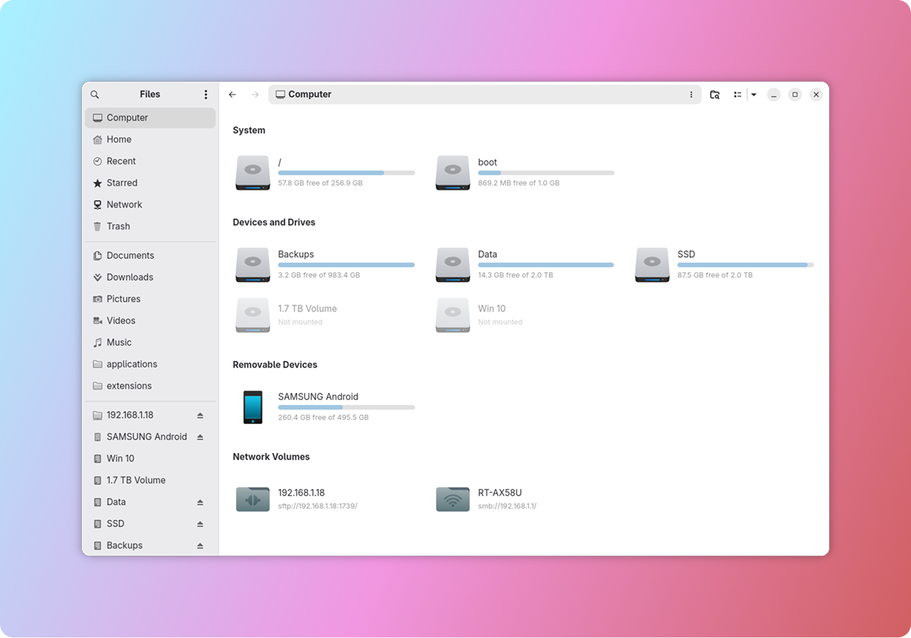
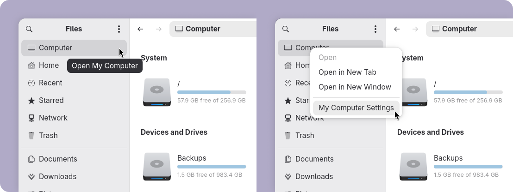
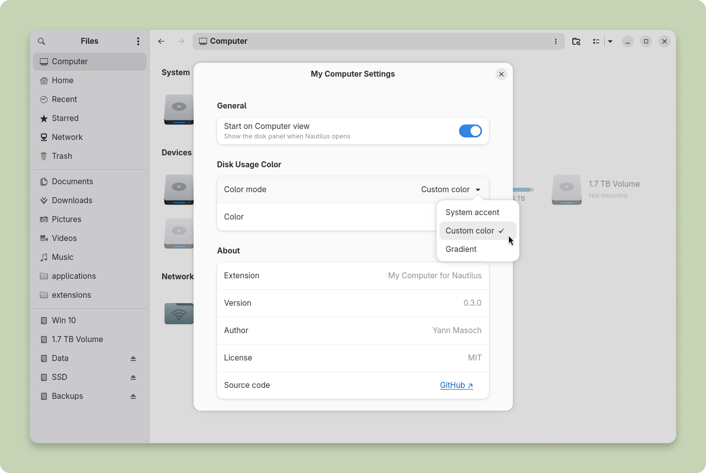
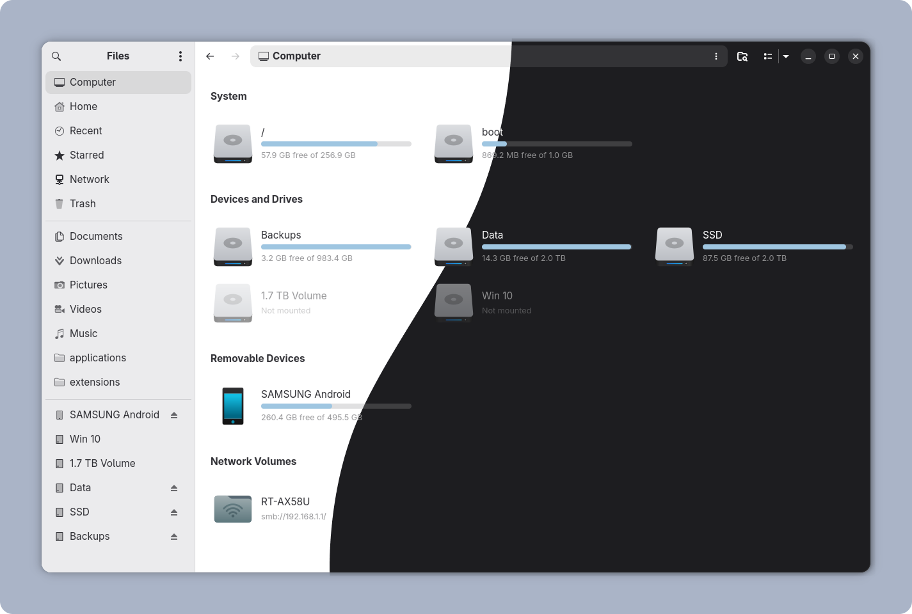

<div align="center">

# My Computer for Nautilus

<br>



<br>


[](https://github.com/yannmasoch/nautilus-my-computer/stargazers)

<br>

**My Computer** is a custom view for GNOME Files (Nautilus), showing all your drives, volumes, and network mounts with usage levels in one clean panel.

*"GNOME dropped the Other Locations view and left nothing in its place. I built what should have always been there and in a better way, for the GNOME community with ❤️"*

</div>

## Installation

### Quick install (recommended)

```bash
curl -fsSL https://raw.githubusercontent.com/yannmasoch/nautilus-my-computer/main/install.sh | bash
```

### Manual install from a local clone

```bash
git clone https://github.com/yannmasoch/nautilus-my-computer.git
cd nautilus-my-computer
bash install.sh
```

### What the installer does

1. Installs the Python bindings if needed (`python-nautilus` on Arch, `python3-nautilus` on Debian/Ubuntu/openSUSE, `nautilus-python` on Fedora)
2. Copies `nautilus-my-computer.py` → `~/.local/share/nautilus-python/extensions/`
3. Copies the GSettings schema → `~/.local/share/glib-2.0/schemas/` and recompiles
4. Asks whether to restart Nautilus (nautilus -q && nautilus), recommended to activate the extension immediately

Nothing is written outside your home directory.

> To uninstall, re-run the installer and choose **Uninstall**. It removes the extension, the schema, and resets all preferences.

## My Computer

### Sidebar integration

Computer sits at the top of the GNOME Files sidebar, click to open the panel and right-click for settings.



### Settings page

My Computer Settings let you open GNOME Files directly on the Computer view at startup, and customize the disk usage bar color to match your style.



> Settings are stored via GSettings under `io.github.yannmasoch.nautilus-my-computer` and persist across sessions.

## Style

### Color mode for disk usage bars

Disk usage is shown as a native `Gtk.LevelBar`. Three color modes are available in Settings.


- **Gnome Accent Color** follows your GNOME accent color automatically
- **Custom Color** a single custom color
- **Custom Gradient** a two-color custom gradient

### Light and dark mode

The panel follows GNOME's light/dark preference natively, with no extra configuration.



### GNOME icon theme

All icons are native GNOME icons. My Computer works with any custom icon theme.

## Features

- **All your storage in one place:** local drives, USB sticks, phones, network mounts, and removable media grouped by type.
- **Usage bars:** at-a-glance capacity for every mounted volume.
- **Mount & eject:** mount, unmount, and eject volumes directly from the panel without leaving Files.
- **Live refresh:** the panel updates automatically when drives are connected or disconnected.
- **Fully native:** follows your GNOME accent color, icon theme, and dark/light mode with no extra configuration.
- **Customizable bars:** choose between GNOME accent color, a custom color, or a custom gradient for the usage bars.
- **Start on My Computer:** choose to open GNOME Files directly on the My Computer panel every time.
- **Right-click context menu:** open, open in new tab, open in new window, mount, unmount, and eject volumes directly from a native-feel context menu.
  
## Tested on

| | Distro | GNOME Files | Status |
|---|--------|-------------|--------|
| ✅ | Arch | 50.2.2 | Fully working |
| ✅ | Fedora 44 Workstation | 50.2.2 | Fully working |
| ✅ | Fedora 44 Workstation | 50.0 | Fully working |
| ✅ | Ubuntu 26.04 LTS | 50.0 | Fully working |
| ☑️ | Zorin OS 18 | 46.4 | Partial, background colors and the My Computer menu entry are not available (Zorin ships a customised build of GNOME Files). Will be improved in a future release |

> GNOME Files versions below 50 may have limited functionality. Full support targets GNOME Files 50+.

## About

GNOME Files has no public API for adding custom views anymore. **My Computer** injects itself directly into the Nautilus widget tree at runtime, something no other extension currently does.

This unconventional approach is what makes it feel truly native, but it also means the extension relies on internal Nautilus structures that are not guaranteed to stay stable across versions.

Some integration points can break when GNOME Files changes its internal layout, as seen on Zorin OS 18.

These weak points are known and documented. Each release consolidates them further toward stability.

The goal is for My Computer to feel indistinguishable from a built-in feature and to stay that way across GNOME updates.

## For GNOME community

**My Computer** is built for GNOME community with ❤️ and your feedback is important!

*“They did not know it was impossible, so they did it”* ― Jean Cocteau (1954)